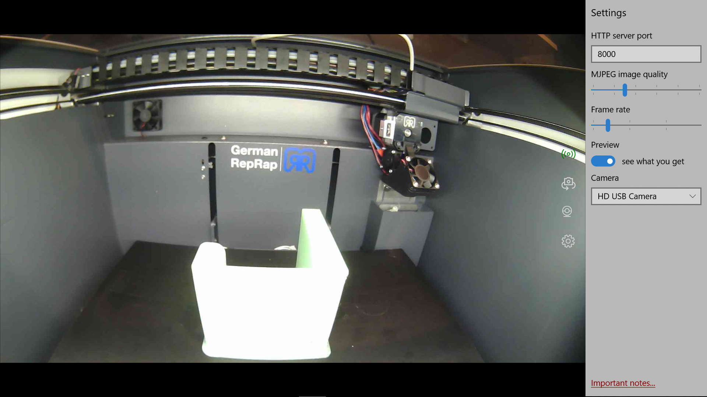

# MJPEG-Streamer-Universal-Windows-App
Streams USB and bulit-in camera video as MJPEG data over HTTP. JPG retrieval of single images is implemented too.
* image rotation
* internal and USB camera support
* JPEG compression level
* frame rate
* MJPEG over HTTP
* JPEG over HTTP
* auto-stores last config

Developed as Windows 10 Universal App in C#. 



### Note:
* App is now also able to run in background, at the cost of needing to use ExtendedExecutionForeground credentials.
* It is not a windows service and thus does not (yet) automatically launch as a background service at startup.

### Warning:
* This app uses simple HTTP which is insecure. Also there is no authentication in place at the moment. 
So use only on your local intranet and not as a service to public internet users.

## Usage:

### remote configuration 
Remote configuration of a running MJPEG Streamer app. impacts all streams.
```http
http://<remotehost>:8000/configure?quality=30&framerate=5
```

* quality: 0..100, 0 is max compression, 100 is largest JPEG
* framerate: 1..30 per second

### MJPEG stream
The MPEG stream over HTTP. It is streamed in the same format as the Linux mjpg-streamer to be compatible with common webcam stream receivers.
```http
http://<remotehost>:8000/stream.mjpeg
```

### JPEG image
Retrieves a single JPEG image. This should work in any browser.
```http
http://<remotehost>:8000/image.jpg
```

## Build Instructions
The build is fairly straigtforward as there arent any 3rd party dependencies. Get the folder from Github and run Visual Studio. Thats it.

1. You will need a Windows 10 computer to build MPEGStreamer UWP App for Windows 10. (I built on Fall Creators update. Earlier versions might work too, but that needs changes in the solutions manifest.)
1. Download and install Visual Studio 2017 Community Edition if you dont have it or a premium variant of it. 
1. Open the .sln and build your target to test it
1. Once its working, go to Menu "Project->Store->Create App Packages...". You then select "No" to not upload the package to the store. Start the build process.
1. Once the build completed, you will find resulting package in ``MPEGStreamer\AppPackages\MJPEGStreamer_1.1.x.0_Test``. Copy this folder to the computer with the Webcam that you want to stream. Launch ``Add-AppDevPackage.ps1`` using the File Explorers context Menu "Run with PowerShell". This will ask for proper permissions and install the app.
1. Note that previous step might need Sideload apps or Developer mode permission activated, which you find in the Windows 10 settings->Update&Security->For developers area.


